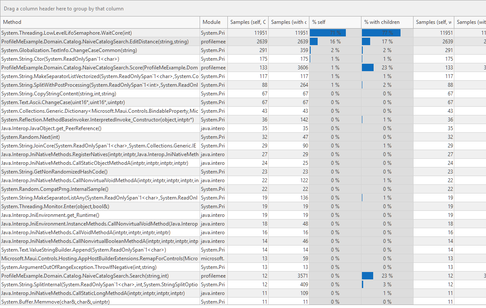
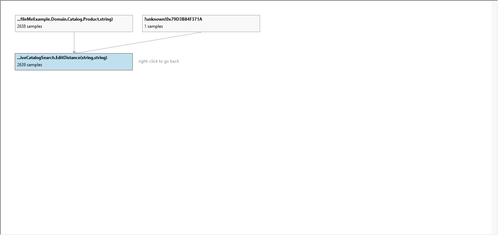

# net-android-debugger-profiler

A **debugger** and a **profiler** for .NET for Android applications — C# on MonoVM, .NET MAUI
apps included — driven by AI agents through MCP, by editors through the Debug Adapter Protocol,
and by people through a desktop GUI and a command line.

They answer the questions a real app raises on a real device:

| The question | What answers it |
|---|---|
| This screen takes four seconds to open. Where does the time go? | CPU sampling: hottest methods, call tree, callers and callees |
| Which of these calls is slow, and how often is it made? | Instrumenting: exact call counts and times per method, async and iterator bodies included |
| Memory keeps growing. What is holding it? | Heap snapshots and the growth between two of them, by type |
| Why does it allocate so much? | Allocations by type and by allocating method |
| Why does it crash, or return that value? | Breakpoints, stepping, locals, expression evaluation, ordered exception rules |
| What happens after this exact line? | Both at once: stop at a breakpoint, then profile the same process from there on |

Everything runs against an app installed on an emulator or an attached device; nothing is
simulated, and no source is required beyond what the app was built with.

## Install

A release is one folder. Unpack it and run, on Windows:

```
install.cmd
```

That registers **one Claude Code plugin**, which brings the MCP server and the operating skill
together, and puts a shortcut to the profiler GUI on the desktop. `install.cmd /remove` undoes
both; `/no-shortcut` skips the shortcut; `/mcp-only` registers the server alone (plus a copy of
the skill under `%USERPROFILE%\.claude\skills`) for a Claude Code without plugin support.

By hand, on any system with Claude Code:

```
claude plugin marketplace add <the unpacked folder>
claude plugin install net-android@net-android
```

**What you need**: the .NET 10 runtime for the server and the tools; the .NET SDK with the
`android` workload to build an app for profiling or debugging; the Android platform-tools
(`adb` on PATH, or `ANDROID_HOME` / `ANDROID_SDK_ROOT`); a device or emulator with USB
debugging on. `dotnet-dsrouter` travels inside the package.

**What is in the package**: the unified MCP server and its dependencies (`bin/`), the profiler's
command line `nap` and its weaver, `dotnet-dsrouter` (`tools/`), the MSBuild targets for
build-time weaving (`build/`), the GUI (`gui/NapGui.exe`), and the plugin files that make the
folder installable — including the skill in `skills/net-android/`. Building a release:
`gui\build-gui.cmd` (RAD Studio) then `powershell -File build\package.ps1`; the details are in
[docs/profiler/PACKAGING.md](docs/profiler/PACKAGING.md).

## Use it

**With an agent.** Ask Claude Code to profile or debug the app. The plugin's skill is the
operating guide: it starts with `list_devices`, `list_app_projects` and `check_app`, builds the
app for the right purpose with `build_app`, chooses the profiling mode the question needs,
reads the numbers correctly and knows the traps. When a finding is easier seen than told, it
has the GUI draw the panel and shows the picture. Read it at
[plugin/skills/net-android/SKILL.md](plugin/skills/net-android/SKILL.md).

**With the GUI.** `gui\NapGui.exe`: point it at a solution, a project or a source folder, and it
fills in the package, the build output and the callspec from the project files, builds and
installs the app, runs the session and shows the results. Every session is a SQLite database
that any frontend — or any SQLite client — reads.

The report names the hot methods and shows their share; the call graph puts one of them
between its callers and its callees. Both pictures below are of the example app's "slow
search" screen, and both were drawn by the GUI itself on request — the agent asks for a
panel and gets the image back, with no window on anyone's screen:





**With the command line.** `nap doctor` says what the machine offers, `nap devices` lists them,
`nap run --package <id> --mode sampling --duration 20` profiles and prints where the result
database is.

**With VS Code.** The debugger also speaks the Debug Adapter Protocol; its extension lives in
`vscode/` and is installed from this repository with
`vscode\install-vscode-extension.cmd`.

## The two products

| Product | What it is | Sources | Read first |
|---|---|---|---|
| **net-android-debugger** | Breakpoints, stepping, stack, locals, evaluation and an ordered exception rule engine over the Mono Soft Debugger protocol, plus screen tools (screenshot, UI hierarchy, tap, swipe, keys) so an agent can bring the app to the point worth debugging. Frontends: MCP server (`net-android-debugger`), DAP adapter, VS Code extension. | `src/NetAndroidDebugger.Core`, `.Mcp`, `.Dap`, `.Shared`; `ThirdParty/debugger-libs` (submodule); `vscode/` | [docs/debugger/README.md](docs/debugger/README.md) |
| **net-android-profiler** | CPU sampling, allocation and heap analysis, instrumenting through the runtime's Mono profiler provider or a runtime-independent IL weaver; results in a versioned SQLite database. Frontends: MCP server (`net-android-profiler`), `nap` (one-shot commands and the local control service), the DevExpress GUI `NapGui.exe`. | `src/NetAndroidProfiler.Core`, `.Mcp`, `.Cli`, `.Weave`, `.Collector`; `gui/`; `build/` | [docs/profiler/README.md](docs/profiler/README.md) |

Both are driven through **one MCP server**, `net-android` (`src/NetAndroid.Mcp`): every debugger
and profiler tool in one process, the three tools both products define answered once, and the
device-global Mono state arbitrated so that debugging and profiling never start on the same
device at the same time — with one exception, profiling the very app the debugger is running.
Why the two products share a repository, the shared device library `src/NetAndroid.Device` and
the unified server are in [docs/ARCHITECTURE.md](docs/ARCHITECTURE.md).

## Build from source

```powershell
git clone --recurse-submodules git@github.com:csm101/net-android-debugger-profiler.git
cd net-android-debugger-profiler
dotnet build NetAndroidDebuggerProfiler.slnx     # everything, the example app included
dotnet build NetAndroidDebugger.slnx             # the debugger only
dotnet build NetAndroidProfiler.slnx             # the profiler only, the example app included
```

Requires .NET SDK 10 with the `android` workload (the MAUI example builds with the
`Microsoft.Maui.Sdk` pack that workload set installs), the Android SDK platform-tools (`adb`;
both products find it without PATH, through `ANDROID_HOME`, the registry or the SDK's default
folders), and for the profiler the global tools `dotnet-dsrouter` and `dotnet-trace`.
`ThirdParty/debugger-libs` is a submodule pinned to a fork: after a plain `git clone`, run
`git submodule update --init` or the debugger does not build.

Working from the sources, each server is published and registered with Claude Code by its own
script (a Claude Code with all three registered sees every tool twice; `register-mcp.cmd` says
which two registrations to remove once the unified server is in use):

```
register-mcp.cmd               publishes to %LOCALAPPDATA%\net-android and registers net-android (both products, one server)
register-mcp-debugger.cmd      publishes to %LOCALAPPDATA%\net-android-debugger and registers net-android-debugger
register-mcp-profiler.cmd      publishes to %LOCALAPPDATA%\net-android-profiler and registers net-android-profiler
vscode\install-vscode-extension.cmd   installs the debugger's VS Code extension (junction into the extensions folder)
build-gui.cmd                  builds the profiler GUI, gui\NapGui.exe (RAD Studio with DevExpress and SynEdit)
build\package.ps1              builds the release package described under Install
```

## Test

```powershell
dotnet test NetAndroidDebugger.slnx                                  # the whole debugger suite (needs a device)
dotnet test NetAndroidProfiler.slnx --filter "Category!=Device"     # the profiler's recorded-trace tests
dotnet test NetAndroidProfiler.slnx                                  # plus the profiler's device tests
dotnet test tests/NetAndroid.Device.Tests/NetAndroid.Device.Tests.csproj   # the shared device layer (docs/TEST_CATALOG.md)
dotnet test tests/NetAndroid.Mcp.Tests/NetAndroid.Mcp.Tests.csproj         # the unified MCP server and the skill (docs/TEST_CATALOG.md)
```

Both suites drive their real engine against a real app on the Android emulator or an
attached device. With more than one device attached neither guesses: `NAD_DEVICE_SERIAL`
names the debugger's device, `NAP_TEST_SERIAL` the profiler's. `DevTools/scripts/ensure-emulator.sh`
brings an emulator up (`AVD=<name> SERIAL=emulator-5554`). The two device suites share one
device only in turn: the debugger sets a device-wide Mono property while it runs. Each
product's `TEST_CATALOG.md` says what is covered.

## The example app is the profiler GUI's tutorial

`examples/ProfileMeExample.sln` is a .NET MAUI Android app built to be profiled: every
screen carries one deliberate performance problem, chosen so that a different feature of the
profiler is the one that exposes it, and every screen has a Guide saying what to look for.
It is a shipped part of the repository, not a test fixture. The per-screen table, the build
and install command, the package name, the symbols folder and the callspec are in
[docs/profiler/README.md](docs/profiler/README.md#example-app-profilemeexample); the Guide
texts live in `examples/ProfileMeExample/Scenarios/ScenarioCatalog.cs`. Future debugger
examples go beside it under `examples/`.

## Layout

```
src/NetAndroidDebugger.Core, .Mcp, .Dap, .Shared     debugger engine and frontends
src/NetAndroidProfiler.Core, .Mcp, .Cli, .Weave, .Collector   profiler engine and frontends
src/NetAndroid.Device                                 the device layer both products share (adb, locator, screen, device-side state)
src/NetAndroid.Mcp                                    the unified MCP server over both engines
plugin/                                               the Claude Code plugin: the skill and the registration files the package ships
ThirdParty/debugger-libs                              mono/debugger-libs, git submodule (MIT)
tests/NetAndroidDebugger.Tests, tests/NetAndroidProfiler.Tests, tests/WeaveSample
TestTarget/Debugger, TestTarget/Profiler (+ TestTarget.Support)   the two test apps
DevTools/                                             probes of both products; scripts/ shared
gui/                                                  the profiler's Delphi + DevExpress GUI
build/                                                packaging and build-time weaving targets
examples/                                             ProfileMeExample, the profiler GUI tutorial
vscode/                                               the debugger's VS Code extension and DAP client notes
docs/                                                 ARCHITECTURE.md, KNOWN_UNKNOWNS.md; docs/debugger/, docs/profiler/, images/
```

Each product keeps its living documents under `docs/<component>/`: `ARCHITECTURE.md`,
`PROJECT_STATE.md`, `TASK_RESUME.md`, `KNOWN_UNKNOWNS.md`, `TEST_CATALOG.md` and the
empirical notes (`ANDROID_ATTACH_NOTES.md`, `ANDROID_PROFILING_NOTES.md`). The root
`TASK_RESUME.md` tracks repository-level work.

## What you can expect

This is a tool built to do a job, published because it may do yours too. It is offered as
it is, with no promise of support, of answers, or of a release on any schedule. Issues and
pull requests are welcome and read; neither is a ticket.

One part cannot be built by everyone: the profiler's GUI is Delphi and needs RAD Studio
with DevExpress VCL and SynEdit. Its sources are here under the same license, but the
built `NapGui.exe` in a release is what to use without those. Everything else - both MCP
servers, the DAP adapter, `nap`, the weaver, the tests - builds with the .NET SDK alone.

## Licensing

MIT: see [LICENSE](LICENSE). Copyright MCA Software s.a.s. di Sirna Carlo & C.

Third-party dependencies are restricted to MIT, BSD and Apache-2.0 (plus MPL components
used unmodified in the GUI); GPL is excluded, so that nothing here raises a license
question for whoever uses it. `THIRD-PARTY-NOTICES.txt` lists, in one part per product,
every component the shipped builds carry, with the full license texts; both test suites
fail when a distributed package is missing from it. `ThirdParty/debugger-libs` is a
submodule of a fork of `mono/debugger-libs`, under its own MIT license.
